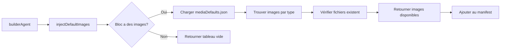

# 🖼️ SYSTÈME D'IMAGES PAR DÉFAUT

## 📋 Vue d'ensemble

Le système d'images par défaut permet aux agents d'injecter automatiquement des images locales depuis `public/images` lors de la génération de blocs Sanity.

---

## 📁 Structure

```
public/images/
├── photo-1486312338219-ce68d2c6f44d.avif  (222 KB)  - Blog
├── photo-1498050108023-c5249f4df085.avif  (581 KB)  - Feature
├── photo-1500530855697-b586d89ba3ee.avif  (1.5 MB)  - Gallery
├── photo-1502920514313-52581002a659.avif  (2.8 MB)  - Team
├── photo-1503602642458-232111445657.avif  (5.4 MB)  - Team
├── photo-1506765515384-028b60a970df.avif  (901 KB)  - Gallery
├── photo-1522202176988-66273c2fd55f.avif  (3.7 MB)  - Hero
├── photo-1556761175-4b46a572b786.avif  (7.8 MB)  - Hero
└── photo-1607746882042-944635dfe10e.avif  (2.3 MB)  - Feature
```

**Total:** 9 images AVIF (~25 MB)

---

## 🔧 Configuration

### mediaDefaults.json

```json
{
  "version": "2.0",
  "source": "local",
  "basePath": "/images",
  "images": [
    {
      "id": "hero-default-1",
      "filename": "photo-1522202176988-66273c2fd55f.avif",
      "url": "/images/photo-1522202176988-66273c2fd55f.avif",
      "alt": "Équipe collaborative en réunion de travail",
      "type": "hero",
      "category": "business",
      "aspectRatio": "16:9"
    }
    // ... autres images
  ],
  "usage": {
    "heroBlock": ["hero-default-1", "hero-default-2"],
    "featureGridBlock": ["feature-default-1", "feature-default-2"],
    "teamBlock": ["team-default-1", "team-default-2"],
    "galleryBlock": ["gallery-default-1", "gallery-default-2"],
    "blogBlock": ["blog-default-1"],
    "testimonialsBlock": ["team-default-1", "team-default-2"],
    "pricingBlock": ["feature-default-1"],
    "ctaBlock": ["hero-default-1"],
    "contactBlock": ["feature-default-2"]
  }
}
```

---

## 🚀 Utilisation

### Dans builderAgent

```javascript
// Injection automatique lors de la création d'un bloc
const injectedImages = injectDefaultImages(blockInfo.name, schemaContent)

// Résultat:
[
  {
    id: 'hero-default-1',
    filename: 'photo-1522202176988-66273c2fd55f.avif',
    url: '/images/photo-1522202176988-66273c2fd55f.avif',
    alt: 'Équipe collaborative en réunion de travail',
    type: 'hero',
    localPath: 'c:/code/.../public/images/photo-1522202176988-66273c2fd55f.avif',
    publicUrl: '/images/photo-1522202176988-66273c2fd55f.avif',
    available: true
  }
]
```

### Scanner les images disponibles

```bash
# Afficher le rapport des images
node agents/core/scanLocalImages.js --report

# Mettre à jour mediaDefaults.json automatiquement
node agents/core/scanLocalImages.js --update
```

---

## 📊 Mapping par type de bloc

| Bloc | Type d'image | Nombre | Exemples |
|------|--------------|--------|----------|
| **heroBlock** | hero | 2 | Équipe, Bureau moderne |
| **featureGridBlock** | feature | 2 | Tech, Innovation |
| **teamBlock** | team | 2 | Portraits professionnels |
| **galleryBlock** | gallery | 2 | Espaces de travail |
| **blogBlock** | blog | 1 | Laptop et café |
| **testimonialsBlock** | team | 2 | Portraits |
| **pricingBlock** | feature | 1 | Tech |
| **ctaBlock** | hero | 1 | Équipe |
| **contactBlock** | feature | 1 | Innovation |

---

## 🔄 Workflow d'injection



---

## 📝 Exemple de génération

### Input
```javascript
builderAgent.run({
  prompt: "Créer un heroBlock",
  dryRun: false
})
```

### Process
1. ✅ Détection du type: `heroBlock`
2. ✅ Recherche dans `mediaDefaults.usage.heroBlock`
3. ✅ Trouve: `["hero-default-1", "hero-default-2"]`
4. ✅ Vérifie existence dans `public/images/`
5. ✅ Retourne 2 images disponibles

### Output
```javascript
{
  ok: true,
  contextId: "abc-123-def",
  handover: {
    manifest: {
      media: [
        {
          id: "hero-default-1",
          url: "/images/photo-1522202176988-66273c2fd55f.avif",
          alt: "Équipe collaborative en réunion de travail"
        },
        {
          id: "hero-default-2",
          url: "/images/photo-1556761175-4b46a572b786.avif",
          alt: "Espace de travail moderne et lumineux"
        }
      ]
    }
  }
}
```

---

## 🛠️ Ajouter de nouvelles images

### Méthode 1: Manuelle

1. Ajouter l'image dans `public/images/`
2. Mettre à jour `mediaDefaults.json`:

```json
{
  "id": "new-image-1",
  "filename": "my-new-image.avif",
  "url": "/images/my-new-image.avif",
  "alt": "Description de l'image",
  "type": "hero",
  "category": "business",
  "aspectRatio": "16:9"
}
```

3. Ajouter dans `usage`:

```json
"heroBlock": ["hero-default-1", "hero-default-2", "new-image-1"]
```

### Méthode 2: Automatique

```bash
# Scanner et mettre à jour automatiquement
node agents/core/scanLocalImages.js --update
```

---

## ⚙️ API

### scanLocalImages()
Scanne `public/images/` et retourne la liste des images.

```javascript
const { scanLocalImages } = require('./core/scanLocalImages')
const images = scanLocalImages()
// Retourne: [{ id, filename, url, alt, type, category, size }]
```

### getRandomImageByType(type)
Retourne une image aléatoire d'un type donné.

```javascript
const { getRandomImageByType } = require('./core/scanLocalImages')
const heroImage = getRandomImageByType('hero')
```

### getImagesByType(type)
Retourne toutes les images d'un type.

```javascript
const { getImagesByType } = require('./core/scanLocalImages')
const teamImages = getImagesByType('team')
```

### updateMediaDefaultsFile()
Met à jour `mediaDefaults.json` automatiquement.

```javascript
const { updateMediaDefaultsFile } = require('./core/scanLocalImages')
updateMediaDefaultsFile()
```

---

## 🎯 Avantages

### 1. **Performance**
- ✅ Images locales (pas de requêtes externes)
- ✅ Format AVIF optimisé
- ✅ Chargement rapide

### 2. **Fiabilité**
- ✅ Pas de dépendance à des APIs externes
- ✅ Images toujours disponibles
- ✅ Pas de rate limiting

### 3. **Contrôle**
- ✅ Images personnalisées au projet
- ✅ Cohérence visuelle garantie
- ✅ Licence contrôlée

### 4. **Automatisation**
- ✅ Injection automatique par les agents
- ✅ Scan automatique du dossier
- ✅ Mise à jour automatique de la config

---

## 📈 Statistiques

```bash
# Afficher les statistiques
node agents/core/scanLocalImages.js --report
```

**Output:**
```
📊 RAPPORT DES IMAGES LOCALES
================================================================================
Total: 9 images

📁 HERO (2)
  - photo-1522202176988-66273c2fd55f.avif (3.51 MB)
    URL: /images/photo-1522202176988-66273c2fd55f.avif
    Alt: Équipe collaborative en réunion de travail
  - photo-1556761175-4b46a572b786.avif (7.41 MB)
    URL: /images/photo-1556761175-4b46a572b786.avif
    Alt: Espace de travail moderne et lumineux

📁 FEATURE (2)
  - photo-1498050108023-c5249f4df085.avif (0.55 MB)
  - photo-1607746882042-944635dfe10e.avif (2.22 MB)

📁 TEAM (2)
  - photo-1502920514313-52581002a659.avif (2.68 MB)
  - photo-1503602642458-232111445657.avif (5.15 MB)

📁 GALLERY (2)
  - photo-1500530855697-b586d89ba3ee.avif (1.52 MB)
  - photo-1506765515384-028b60a970df.avif (0.86 MB)

📁 BLOG (1)
  - photo-1486312338219-ce68d2c6f44d.avif (0.21 MB)
```

---

## 🔒 Sécurité

- ✅ Images servies depuis `public/` (accessible publiquement)
- ✅ Pas de traversée de répertoire
- ✅ Validation des extensions
- ✅ Vérification d'existence avant utilisation

---

## 📚 Références

- **Configuration:** `agents/core/mediaDefaults.json`
- **Scanner:** `agents/core/scanLocalImages.js`
- **Utilisation:** `agents/builderAgent.js` (fonction `injectDefaultImages`)
- **Images:** `public/images/`

---

**Version:** 2.0  
**Dernière mise à jour:** 2025-01-07  
**Format:** AVIF (optimisé)
